# Team-Null-CSTP2205-Android-Programming

# Project Design & Overview

## Section 1 - Project Background

### 1.1 Project Name
Overrun

### 1.2 Team Members
- Samuel Tsz Chun Chow, [@Samuel-Chow-demon](https://github.com/Samuel-Chow-demon)
- Travis Schellenberg, [@Travis975](https://github.com/Travis975)
- Arijit Bhardwaj, [@ArijitBhardwaj](https://github.com/ArijitBhardwaj)

### 1.3 Overview
- This project is a 2D survival mobile game developed using Android Studio. The app features a multi-screen user flow, beginning with a landing page where users can sign in or sign up. Authentication is handled via Firebase OAuth
- Leaderboard system is included and powered by Firebase Firestore, allowing for real-time scrore tracking and global comparison between players
- Gameplay has multiple levels, each with its own unique difficulty
- Game structure is designed to promote progression, replayability, and competitive engagement among players

### 1.4 Features
- Account creation and authenitcation support
- Player moves the character in a world map system
- Player only needs to use a thumb to drag and move the character
- Player only needs to use a thumb to attack by screen tapping 
- Player can kill enemy to gain credit
- Player can compete across multiple stages
- Multiple characters and stages are available
- Enemy would be created from random direction in a random of time intervals 
- Player 's gaming score can be stored in leaderboard
- Necessary data is stored and interact with cloud database services

 

## Section 2 - Language, IDE & Database
|||
|-|-|
|Language|Kotlin|
|IDE|Android Studio|
|Database|Firebase|

 

## Section 3 - Tools Utilization
|Tools|Description|
|-|-|
|Trello Workspace| Work distribution and scheduling|
|Figma| Graph whiteboard|
|One Drive|File sharing and storage|
|DrawIO| Technical drawing|
|Piskel| Game Sprite Creation|

 

## Section 4 - Details & Sprints

### For detailed Information and the sprints development dynamics

[Visit Wiki Here](https://github.com/Travis975/Team-Null-CSTP2205-Android-Programming/wiki)

 

## Section 5 - UI & Sprite Images

### Example images
|Landing|Info|
|-|-|
|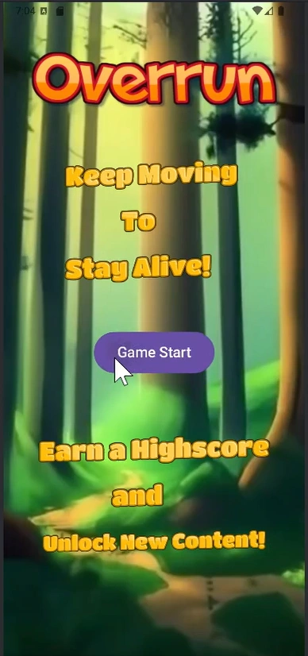|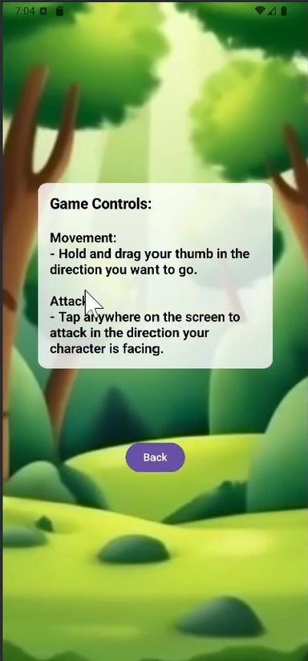|

|Selection|Game Play|
|-|-|
|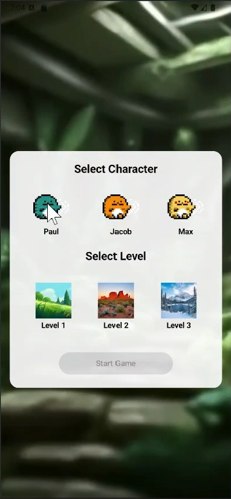|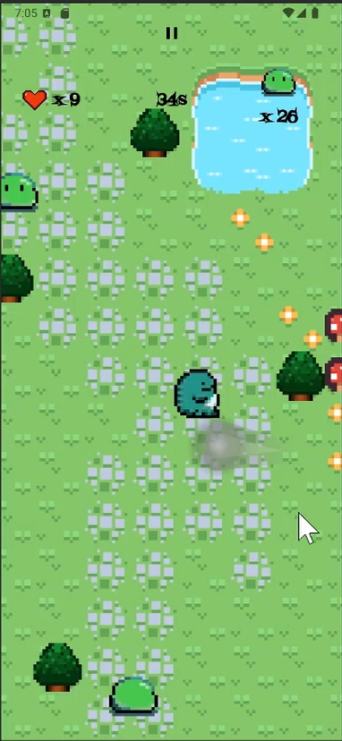|

|Attack|Explose|
|-|-|
|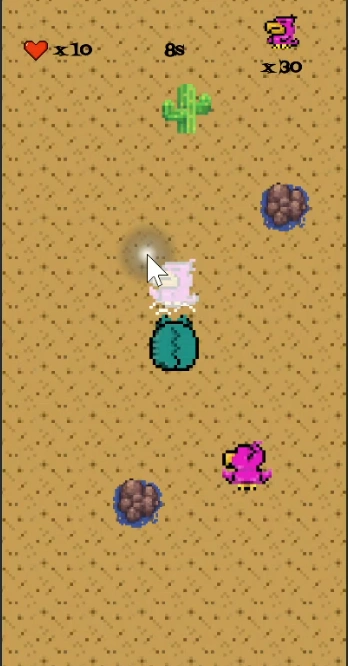|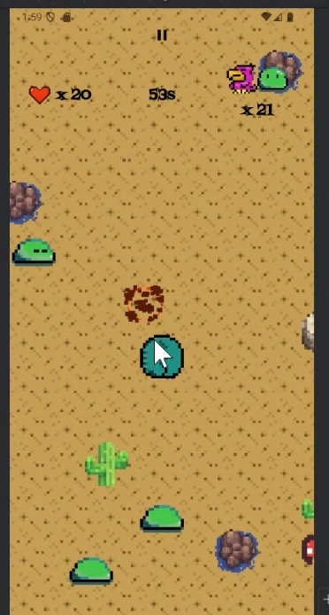|

|Meat Drop|Health Up|
|-|-|
|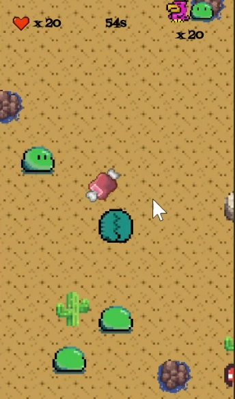|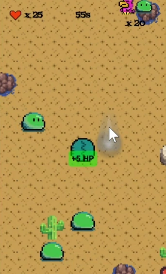|

|Character|Enemy Parrot|Enemy Slime
|-|-|-|
||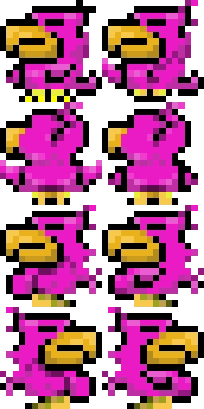|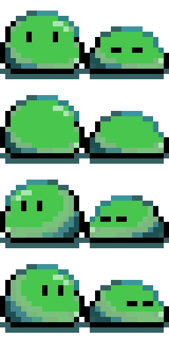|

|Some Sprites|
|-|
|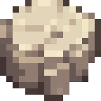 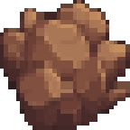 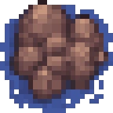 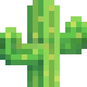  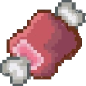 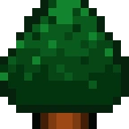|

 

## END of Document

